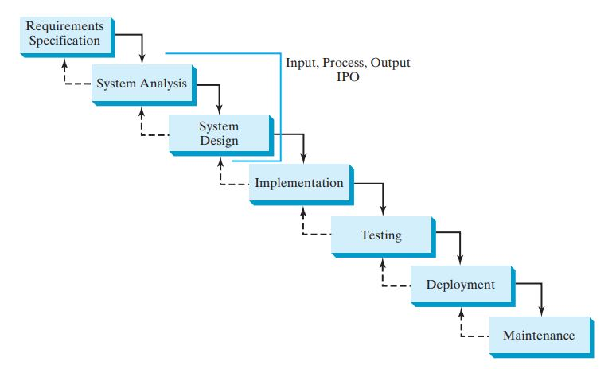

# Software Development Process

## Software Development Process
The software development life cycle is a multistage process that includes requirements specification, analysis, design,
implementation, testing, deployment, and maintenance.

- **Requirements specification** is a formal process that seeks to understand the problem that
  the software will address and to document in detail what the software system needs to do.
  This phase involves close interaction between users and developers.

- **System analysis** seeks to analyze the data flow and to identify the system’s input and output. When we do analysis, 
  it helps to identify what the output is first, and then figure out what input data we need in order to produce the 
  output.

- **System design** is to design a process for obtaining the output from the input. This phase
  involves the use of many levels of abstraction to break down the problem into manageable
  components and design strategies for implementing each component.  We can view each
  component as a subsystem that performs a specific function of the system. The essence of
  system analysis and design is input, process, and output (IPO).

- **Implementation** involves translating the system design into programs. Separate programs
  are written for each component and then integrated to work together. This phase requires
  the use of a programming language such as Java. The implementation involves coding, self-testing, and debugging 
  (that is, finding errors, called bugs, in the code). 

- **Testing** ensures that the code meets the requirements specification and weeds out bugs. An
  independent team of software engineers not involved in the design and implementation of the
  product usually conducts such testing.

- **Deployment** makes the software available for use. Depending on the type of software,
  it may be installed on each user’s machine or installed on a server accessible on the
  Internet.

- **Maintenance** is concerned with updating and improving the product. A software
  product must continue to perform and improve in an ever-evolving environment. This
  requires periodic upgrades of the product to fix newly discovered bugs and incorporate
  changes.